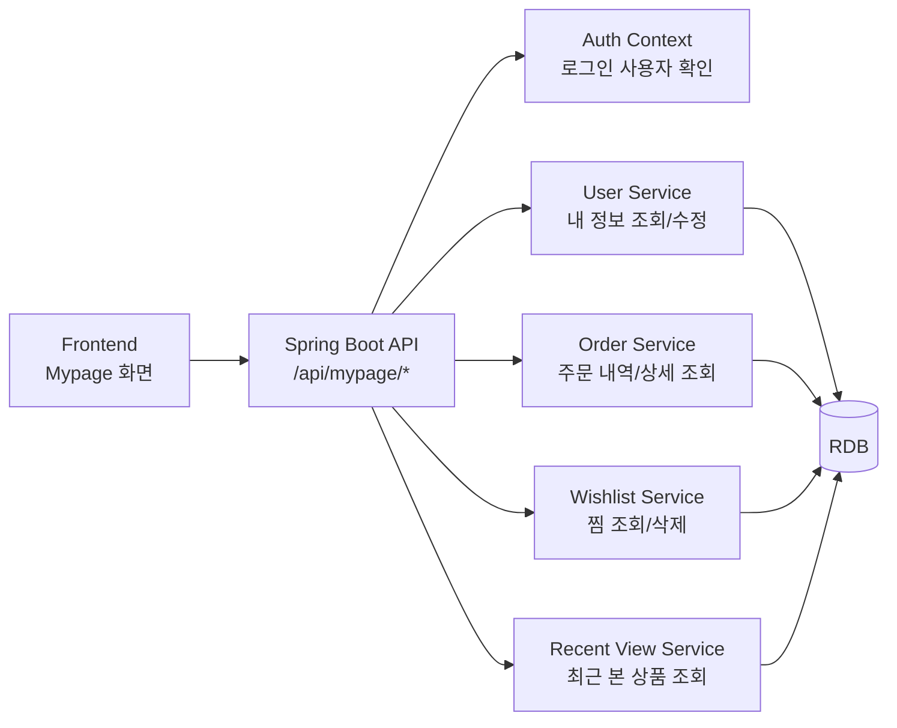

# 마이페이지 아키텍처 초안 v1

담당자: 강민  
범위: 마이페이지 1차 기능  
상태: 팀 아키텍처 병합 전 초안

## v1 전제

- v1은 단일 Spring Boot 서버 + 단일 DB 구조를 기준으로 한다.
- 프론트는 추후 통합 앱에 붙는 것을 전제로 하며, 현재는 `강민/mypage` 정적 mock 화면으로 UI 흐름을 검증한다.
- 마이페이지는 로그인 사용자 기준의 개인 데이터 조회 기능이므로 모든 API에 인증이 필요하다.

## 구성

## API 초안

| 기능 | Method | Path | 설명 |
|---|---|---|---|
| 마이페이지 메인 조회 | GET | `/api/mypage/summary` | 사용자 정보, 주문 수, 찜 수, 최근 본 상품 수 조회 |
| 내 정보 조회 | GET | `/api/mypage/profile` | 로그인 사용자 프로필 조회 |
| 내 정보 수정 | PATCH | `/api/mypage/profile` | 닉네임, 전화번호, 기본 배송지 수정 |
| 주문 내역 조회 | GET | `/api/mypage/orders` | 로그인 사용자 주문 목록 조회 |
| 주문 상세 조회 | GET | `/api/mypage/orders/{orderId}` | 본인 주문 상세 조회 |
| 찜한 상품 조회 | GET | `/api/mypage/wishlist` | 활성 찜 상품 목록 조회 |
| 찜 상품 삭제 | DELETE | `/api/mypage/wishlist/{productId}` | 상품 찜 해제 |
| 최근 본 상품 조회 | GET | `/api/mypage/recent-products` | 최근 조회 상품 목록 조회 |

## 요청/응답 기준

- 모든 API는 access token 기반 인증을 전제로 한다.
- `userId`는 클라이언트에서 받지 않고 서버 인증 컨텍스트에서 가져온다.
- 주문 상세 조회는 `orderId`가 로그인 사용자의 주문인지 검증한다.
- 찜 삭제는 이미 삭제된 데이터에 대해 idempotent하게 성공 처리하거나, 팀 기준에 맞춰 404를 반환한다.

## 에러 기준

| 상황 | 처리 |
|---|---|
| 미로그인 | 401 Unauthorized |
| 본인 주문이 아님 | 403 Forbidden |
| 존재하지 않는 주문/상품 | 404 Not Found |
| 프로필 수정값 형식 오류 | 400 Bad Request |
| 서버 오류 | 500 Internal Server Error |

## v1 성능 고려

- 마이페이지 메인은 요약 수치가 많으므로 필요한 값만 count 쿼리로 조회한다.
- 주문 목록은 페이지네이션을 적용한다.
- 찜/최근 본 상품은 상품 테이블 join이 필요하므로 `user_id`, `updated_at`, `viewed_at` 인덱스를 적용한다.
- Redis 캐시는 v1 필수는 아니며, v2에서 인기/추천/최근 조회 캐시 대상으로 검토한다.

## 현재 프론트 mock 반영

- 현재 화면 파일: `강민/mypage/index.html`
- 현재 동작 파일: `강민/mypage/app.js`
- 현재 스타일 파일: `강민/mypage/styles.css`
- 추후 API 연결 시 `app.js`의 `initialState` mock 데이터를 API 응답으로 교체한다.

## 2026-05-07 추가 API

다른 도메인 기능명세서와 합칠 것을 고려하여 결제 조회 API를 마이페이지 조회 범위에 추가했습니다.

| 기능 | Method | Path | 설명 |
|---|---|---|---|
| 결제 내역 조회 | GET | `/api/mypage/payments` | 로그인 사용자 결제 목록 조회 |
| 결제 상세 조회 | GET | `/api/mypage/payments/{paymentId}` | 본인 결제 상세 조회 |

목업 실행 파일은 프로젝트 루트의 `mypage_mock_server.js`입니다.
