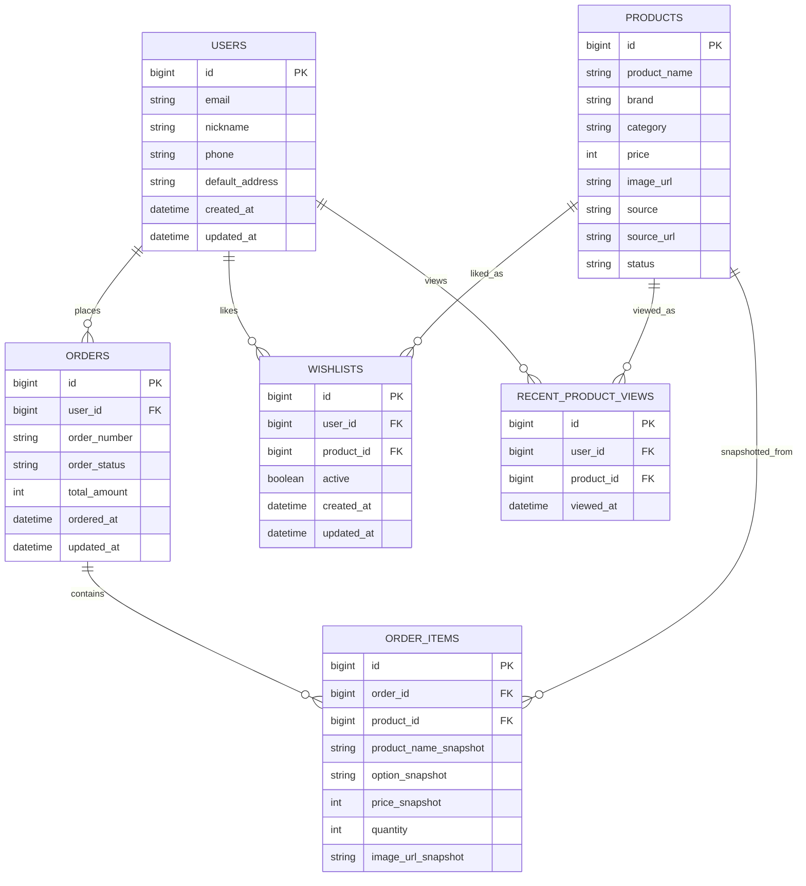

# 마이페이지 ERD 초안

담당자: 강민  
범위: 마이페이지 1차 기능  
상태: 팀 ERD 병합 전 초안

## 설계 기준

- 마이페이지는 사용자 소유 데이터를 조회/관리한다.
- 주문/결제/상품의 원천 테이블은 각 담당 도메인이 소유한다.
- 마이페이지는 `users`, `orders`, `order_items`, `products`를 참조하고, 직접 소유하는 데이터는 `wishlists`, `recent_product_views` 중심으로 둔다.

## Mermaid ERD

## 테이블별 검토

| 테이블 | 마이페이지 사용 목적 | 소유 도메인 |
|---|---|---|
| `users` | 내 정보 조회/수정, 기본 배송지 표시 | 로그인/회원 |
| `orders` | 주문 내역 조회, 주문 상태 표시 | 주문 |
| `order_items` | 주문 상세 상품 목록 표시 | 주문 |
| `products` | 찜/최근 본 상품의 상품 정보 표시 | 상품 |
| `wishlists` | 찜한 상품 조회, 찜 해제/복구 | 마이페이지 또는 상품 |
| `recent_product_views` | 최근 본 상품 조회, 추천 행동 데이터 | 마이페이지 또는 추천 |

## 제약 조건 제안

- `wishlists`: `(user_id, product_id)` unique 적용
- `recent_product_views`: `(user_id, product_id)` unique 적용 후 재조회 시 `viewed_at` 갱신
- `orders`: 마이페이지 조회 시 반드시 `user_id = 로그인 사용자 ID` 조건 적용
- `order_items`: 주문 당시 상품 스냅샷을 저장하여 상품명/가격 변경이 주문 내역에 영향을 주지 않게 한다.

## 인덱스 제안

- `orders(user_id, ordered_at DESC)`
- `wishlists(user_id, active, updated_at DESC)`
- `recent_product_views(user_id, viewed_at DESC)`
- `order_items(order_id)`

## 팀 검토 필요

- `default_address`를 `users`에 둘지, 별도 `addresses` 테이블로 분리할지 결정 필요
- 찜 기능 소유를 `상품` 도메인으로 둘지 `마이페이지` 도메인으로 둘지 결정 필요
- 최근 본 상품 저장 주체를 프론트 이벤트, 상품 상세 API, 추천 로그 중 어디로 둘지 결정 필요
